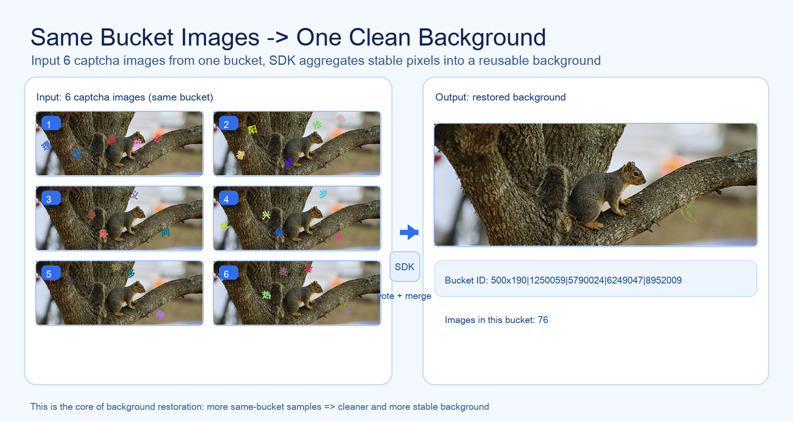

# Captcha Background SDK

在线官网: https://jsrei.github.io/force-fuck-captcha-background/

这个仓库包含桌面端工具、Python SDK 与文档站点，核心目标是把验证码背景恢复与定位能力标准化。

## 同一个 Bucket 的真实流程示例

一句话：同 bucket 多图输入，SDK 聚合去噪，输出可复用背景图。



## 目录划分

```text
.
├── apps/
│   └── electron-ui/              # Electron + React 桌面界面工具
├── sdk/
│   └── python/
│       └── captcha-background-sdk/     # Python SDK（背景映射 + 字体定位）
├── LICENSE
└── README.md
```

## 快速使用

### 1) 启动界面工具

```bash
cd apps/electron-ui
npm install
npm run dev
```

### 2) 使用 Python SDK

```bash
cd sdk/python/captcha-background-sdk
pip install -r requirements.txt
python examples/demo.py
```

### 3) 查看与维护官网文档（VitePress）

```bash
cd docs
npm install
npm run docs:dev
```

构建静态站点：

```bash
cd docs
npm run docs:build
```

文档部署由 GitHub Actions 自动执行（GitHub Pages）：
- 工作流：`.github/workflows/docs-pages.yml`
- 触发：`push main`、`release published`、`workflow_dispatch`
